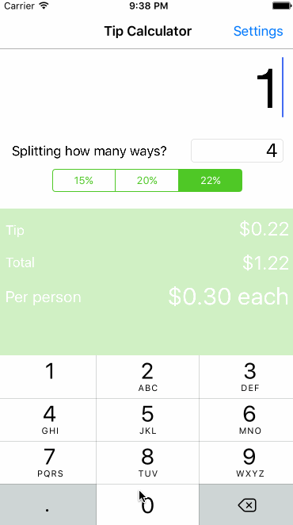

# Pre-work - kim-tippy

kim-tippy is a tip calculator application for iOS.

Submitted by: Kim H. Nguyen

Time spent: 5 hours spent in total

## User Stories

The following **required** functionality is complete:

* [x] User can enter a bill amount, choose a tip percentage, and see the tip and total values.
* [x] Settings page to change the default tip percentage.

The following **optional** features are implemented:
* [x] Animations!!! Fading the bottom-half of the screen in and out.
* [x] The bill input is the first responder - keyboard, stat!
* [x] For those who want to prefer the dark side, I've added a dark theme to the settings page.

The following **additional** features are implemented:

* [x] Figuring out how much to Venmo? After taking the number in your party, *kim-tippy* now calculates the amount to pay per person.

## Video Walkthrough

Here's a walkthrough of implemented user stories:

## Project Analysis

As part of your pre-work submission, please reflect on the app and answer the following questions below:

**Question 1**: "What are your reactions to the iOS app development platform so far? How would you describe outlets and actions to another developer? Bonus: any idea how they are being implemented under the hood? (It might give you some ideas if you right-click on the Storyboard and click Open As->Source Code")

**Answer:** With the advent of auto-layouts in XCode 8, and streamlined code in Swift 3.0, I feel that development in iOS is easier and more engaging than ever (I stayed after work to finish this)! I would describe outlets and actions as linkages between UI elements in storyboards and the source code. At first glance, it looks like they're implemented through nested XML and plenty of attributes to configure each element.

Question 2: "Swift uses [Automatic Reference Counting](https://developer.apple.com/library/content/documentation/Swift/Conceptual/Swift_Programming_Language/AutomaticReferenceCounting.html#//apple_ref/doc/uid/TP40014097-CH20-ID49) (ARC), which is not a garbage collector, to manage memory. Can you explain how you can get a strong reference cycle for closures? (There's a section explaining this concept in the link, how would you summarize as simply as possible?)"

**Answer:** Assigning a *class* instance to a property, constant, or variable creates a strong reference to that instance.  As long as there is one strong reference to that instance, the memory for that class instance will not be deallocated.

A strong reference cycle is where two class instance properties hold a strong reference to each other, thereby keeping each other "alive." In Swift, classes and closures are both *reference* types. This means that when you assign a closure to a property, it will behave the same way you might expect when you assign a class instance to a property -- by creating a strong reference.

Therefore, if you assign a closure to a property of the class instance it belongs to, it will create a strong reference cycle.

In summary, to get a strong reference cycle for closures, a closure of a class should access the "self" property.

## License

    Copyright [yyyy] [name of copyright owner]

    Licensed under the Apache License, Version 2.0 (the "License");
    you may not use this file except in compliance with the License.
    You may obtain a copy of the License at

        http://www.apache.org/licenses/LICENSE-2.0

    Unless required by applicable law or agreed to in writing, software
    distributed under the License is distributed on an "AS IS" BASIS,
    WITHOUT WARRANTIES OR CONDITIONS OF ANY KIND, either express or implied.
    See the License for the specific language governing permissions and
    limitations under the License.
